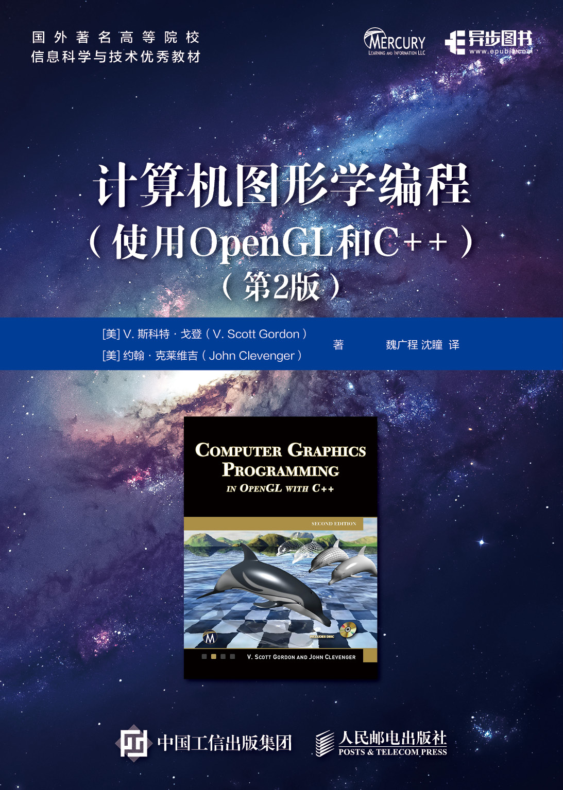

# 🎨 计算机图形学编程 使用OpenGL和C++（第2版） 

<div align="center">
  
</div>

## ✨ 目录
- **Shared**：把章节共享代码整理为静态链接
- **Shader**：每个章节用到的着色器Shader
- **Assets**：保存资源包括模型和贴图
- **examples**: 每个程序都是一个main.cpp
- **3rdparty**: 包含的submodule第三方包含Cmake库

## 🚀 快速开始
```bash
cmake -G "Unix Makefiles"
./build/bin